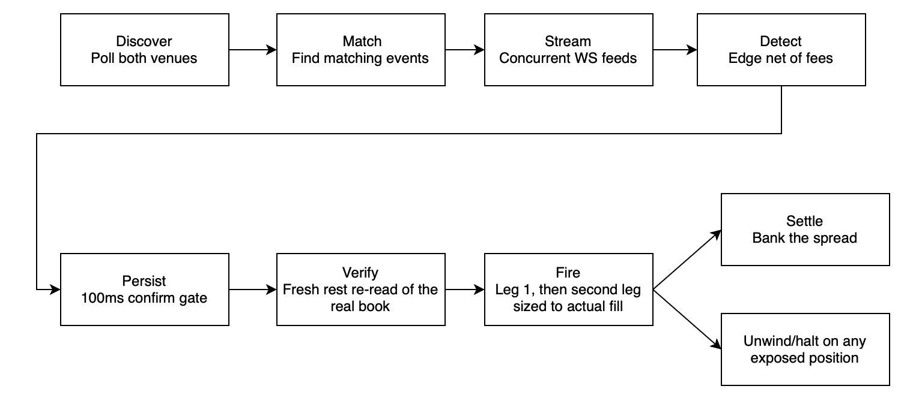

# Cross-Venue Arbitrage Engine

A real-time engine that detects and executes cross-venue arbitrage between two prediction-market exchanges – **Kalshi** and **Polymarket US** – over concurrent WebSocket feeds.

> **Status: Pre-Live, by design**
>
> This system has been running in dry-run measurement mode: the full detection and fire-path logic executes against real market data and logs what *would* have happened, in depth, without placing an order. That's the methodology, not a limitation. The entire logging structure exists to answer one question before any capital is at risk: are these edges real, fillable, and durable through settlement? Shipping a live-trading bot before that proof is what I'm trying to avoid. The only live orders placed have been tiny, deliberate probes to ground-truth venue behavior (exact fees, real order-round-trip latency); never a live arbitrage trade. `CASE_STUDY.md` is the story of what the evidence showed, including the conclusions the data forced me to reverse.

---

## The idea in one paragraph

Two exchanges list the same real-world event – for example, a baseball game. Kalshi prices *"Team A wins"* at \$0.55; Polymarket prices *"Team B wins"* at \$0.40. Buy both for **\$0.95**. Exactly one outcome must occur, and the winner pays \$1.00, so you keep the **5¢ spread regardless of who wins**. This is a locked profit, not a prediction. The strategy is easy to state. Everything hard and interesting about this project is that each step of *finding* such a spread can lie to you: a stale quote invents an edge that isn't there, a name collision hedges the wrong game, trading venues can change their fees without notice, and a "guaranteed" profit can strand one leg and become a directional bet. The engineering is the apparatus built to catch those inaccuracies before any real money moves.

## What makes it interesting

This project is built around **distrusting its own detector**. A scanner that finds arbitrage is easy to write and easy to fool; the load-bearing work is the instrument built to catch the scanner being wrong, and the discipline to believe the instrument over the hope that the edge is real. Some of what that instrument found, measured on the live feeds:

- **~69% of detected "arbitrage" was a stale-feed illusion.** A fire-path re-read against each venue's *real* order book – bypassing a 30-second CDN cache – showed that the naïve approach surfaced mostly edges that had no tradeable liquidity behind them. Lagging quotes manufactured spreads that the book never backed. The detector was systematically finding broken feeds and cached (stale) data, not mispricings.
- **The exchange's own API docs were wrong about order execution, I only caught it by testing the real API.** Polymarket claims it supports fill-or-kill orders ("fill entirely or cancel"). In reality, it rewrites them to immediate-or-cancel ("fill what you can"), with no error and no warning. That difference is fundamental to an arbitrage engine: a leg you believe is all-or-nothing, but that can quietly fill partway, can strand you in a one-sided directional bet – exactly the outcome the arbitrage is supposed to make impossible. I proved it with a real order: a fill-or-kill for 300 shares that couldn't complete **should have returned 0 filled – it filled 255.** The raw response was deceptive even then: the first execution reported `0`, with the real fill buried in a later message. So I built the execution path around the behavior the API *actually has*, not the one it documents.
- **The fee model was quietly wrong, hiding real edges.** Kalshi's fee schedule shows a display table rounded up to the nearest cent; while the actual formula rounds up to the nearest hundredth of a cent. I implemented my code based on the table, which overcharged the fee and so understated every edge the bot ever logged by up to almost 1¢ per contract. I only trusted the fix after deliberately placing a handful of tiny real orders to see the exact charge the exchange applied, then pinning the formula to those real fills. The correction recovered **~10% (327 of 3,234)** of opportunities the bot had been rejecting as unprofitable – they'd cleared the threshold all along, once the fee was computed correctly.
- **A matcher was silently hedging the wrong game.** For doubleheaders (two games between the same teams on one day), the matcher paired one venue's game 1 against the other's game 2 - turning **149 of 264** logged "guaranteed profit" opportunities into one-sided bets with a full-loss branch, booked under a field ironically named `guaranteed_profit`. Caught by a physical-consistency check on game start times.

The full narrative of this project, including the bugs I caught in my own code and the conclusions the data forced me to reverse, is in **[`CASE_STUDY.md`](CASE_STUDY.md)**.

## Architecture at a glance



1. **Discover**: Poll both venues every 5 minutes for open markets across the covered sports. 
2. **Match**: Pair markets on the *same* real-world event. This involves a variety of checks: names differ across venues, cities collide across sports (or even within sports in some cases), teams can play multiple times a day. **Fail-closed** – an unrecognized sport matches *nothing* rather than risk a phantom pairing.
3. **Stream**: Subscribe to websocket feeds for all discovered games, streaming live prices over concurrent WebSocket feeds (~370 msg/s).
4. **Detect**: On every tick, check every matched pair: does the pair cost less than \$1.00 **with both venues' fees factored in**? Fees are inside the edge from the start.
5. **Persist**: Require the edge to survive a short confirmation window; a one-tick flicker isn't tradeable.
6. **Verify**: The moment an edge clears the confirmation window, re-read *both* real order books fresh (cache-busted) right before firing. Is the size actually there at that price? **This is where ~69% of edges die.** The verify is deliberately the *last* step before the trade, so it reads the freshest possible book - a check run any earlier could go stale during the confirmation wait.
7. **Fire**: Place the first leg, then hedge the second **sized to what actually filled**, never the detection-time estimate. If the hedge misses, flatten (sell back) the first leg immediately.
8. **Settle**: A failed flatten is an exposed position: halt all trading, alert, and unwind. On success, one venue will pay \$1 on the winner and the spread is banked.

## Design principles

- **Fail toward doing nothing.** Every uncertain component chooses the failure that costs an *opportunity* over the one that costs *money*: an unmapped sport matches nothing, an unverified settlement pairing is blocked, an unreadable book reads as zero depth and skips the trade.
- **Only hedge markets that settle identically.** Two markets are paired only after a rules-text check confirms they are based on the same official outcome (winner, draw handling, overtime); anything unverified is blocked, not traded. The whole strategy rests on that assumption holding, and so far it has. Across **408 settled games** (MLB, WNBA, World Cup, ~4 weeks) there have been **zero settlement divergences and zero voids**. The paired markets never once settled to conflicting payouts, including World Cup group games that can end in a draw.
- **Size off reality, not intent.** The hedge leg is always sized to the *actual* fill quantity of the first leg, so a partial fill can't create an over-hedged naked position, breaking the math inherent to arbitrage.
- **Don't count profit before it's real.** The engine tracks three numbers separately and never blends them: what a trade actually cost to execute, the profit it *looks* like it locked the instant both legs fill, and the profit that actually landed after the event settled and paid out. Only that last, fully-settled number is allowed to size the next trade. Concretely, *settled* losses (not the optimistic booked ones) are what count against a hard cumulative-loss cap that halts trading, and position size only scales up once settled results justify it. Sizing off profit you *think* you locked but haven't collected is exactly how you fool yourself into scaling up a strategy that isn't actually working.
- **Distinguish different ways a feed can die.** A dropped socket, a silent-but-connected stream, and a *frozen* book (messages flowing, prices never changing, no error from venue) are three separate detectors. The frozen book bit me early, as it's the one that silently feeds phantom edges into detection while looking healthy. 
- **Deploy only on evidence.** Capital goes in only once the measurements say the edges are real, fillable, and settle clean – gated on the data, not a date. The apparatus that would greenlight the strategy is the same one built to be able to retire it, and I'd rather learn it doesn't work from the dry-run data than from a drawdown.

## Tech

**Python · asyncio · WebSockets · REST · pytest.** The concurrency and failure handling are hand-written on `asyncio` – no heavyweight framework hiding the control flow behind decorators or an event bus, so every reconnect, timeout, and race is explicit and testable. ~8,000 lines of engine (~19,000 with scripts and tests).

**Latency.** Deployed in-region (AWS us-east-1). Colocation cut the Kalshi quote round-trip from **~74 ms** (measured from a laptop in Vancouver) to **~14 ms** on the server – roughly **5×**. Separately, placing both order legs measures **~78 ms** on production (Polymarket ~61 ms, Kalshi ~17 ms) via zero-fill probe orders that place nothing real – comfortably inside the ~0.3 s the detected edges actually persist. (The complete story – why I nearly abandoned the strategy on a latency assumption the measurement then reversed – is in the case study.)

## Testing

- **800+ tests**, pure and mocked, running on every change (~3 s).
- The money path is **mutation-tested**: for each safety-critical fix, reverting it must fail a specific test – a green suite that still passes with the fix removed is treated as insufficient coverage.
- Venue behavior is pinned against **captured real responses**, not hand-written fixtures. This is both to remove inconsistencies and to solve the problem of inaccurate API docs – a common issue with both Polymarket and Kalshi.

## Repository layout

```
bot/
  kalshi/        Kalshi client, cross-venue arb detection, settlement logic
  poly_us/       Polymarket US client + WebSocket feed
  runner/        execution path, gates, unwind/strand handling, reconciliation
  core/          config, matching, positions, alerts, safety
tests/           800+ pure/mocked tests
scripts/         measurement + calibration probes (read-only)
CASE_STUDY.md    the narrative: what the instrument found, and where I was wrong
ARCHITECTURE.md  the technical deep-dive
```

## Scope & disclaimer

This is a personal research project. It runs in a dry-run measurement mode; the only live orders placed have been tiny, deliberate probes to ground-truth venue behavior (exact fees, order round-trip latency), never a live arbitrage trade. Nothing here is financial advice or an invitation to trade. Operational configuration (deployment specifics, position sizing, venue credentials) lives outside this repository by design. The methodology and engineering are the point.

This is a **public engineering snapshot**, complete enough to read and test but intentionally not a turnkey deployment: credentials, tuned production values, the full settlement-equivalence allowlist and team table, and the measurement results are kept private (the code loads them from gitignored overlays / `.env` at runtime). See [`NOTICE.md`](NOTICE.md) for exactly what is and isn't included, and why.
